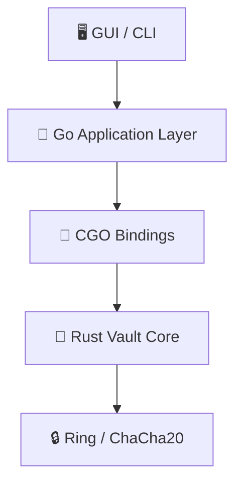

<div align="center">

# 🔒 dirLocker
### secure • cross-platform • invisible

[](https://github.com/aka-0x4C3DD/dirLocker/actions)
[](LICENSE)
[](go.mod)
[](vault-core/Cargo.toml)
[](README.md)

[Getting Started](#-quick-start) • [Features](#-features) • [Dev Guide](docs/development.md) • [Architecture](docs/architecture.md) • [Contributing](#-contributing)

</div>

---

## 💫 About
**dirLocker** is a state-of-the-art encrypted file vault application designed for paranoia-level security and seamless usability. It combines a high-performance Rust cryptographic core with a flexible Go application layer to deliver military-grade encryption, plausible deniability, and cross-platform native interfaces.

Whether you need to secure personal documents, hide sensitive data, or share secrets securely, dirLocker provides a fortress for your digital assets.

## ✨ Features

| Feature | Description |
| :--- | :--- |
| **🔐 Strong Encryption** | AES-256-GCM and XChaCha20-Poly1305 (Pure Rust Core) |
| **👻 Plausible Deniability** | Advanced file hiding capabilities make vaults invisible to the OS |
| **📂 Virtual Drive** | Mount vaults as native drives using FUSE, Dokany, or WinFSP |
| **🤝 Secure Sharing** | Share access securely via X25519 authenticated key exchange |
| **🔑 Recovery System** | Cryptographic recovery keys ensure you never lose access |
| **🖥️ Cross-Platform** | Native CLI and GUI experiences for Windows, Linux, and macOS |

## 📚 Documentation
- **[User Manual](docs/manual.md)**: How to use the CLI and GUI.
- **[Development Guide](docs/development.md)**: How to build, test, and contribute.
- **[Architecture](docs/architecture.md)**: Deep dive into the design and security.
- **[Go Internals](docs/go_internals.md)**: Details of the Go implementation and CGO bindings.
- **[Filesystem Tech](docs/filesystem.md)**: Implementation details of FUSE/Dokany mounting.
- **[File Hiding](docs/file_hiding.md)**: OS-level invisibility mechanics.
- **[Plausible Deniability](docs/deniability.md)**: Deep dive into hidden volumes.
- **[Security](docs/security.md)**: Cryptography and threat model details.

## 🚀 Quick Start

### Installation
Download the latest release for your platform from the [Releases](https://github.com/aka-0x4C3DD/dirLocker/releases) page.

### Building from Source
For detailed build instructions, see the **[Development Guide](docs/development.md)**.

**Quick Build (Requires Go + Rust + GCC):**
```bash
make build
```

## 🏗️ Architecture

The project follows a robust layered architecture:



*   **Rust Core**: Handles all low-level crypto, file format parsing, and memory security.
*   **Go Layer**: Manages OS integration, file mounting, and high-level logic.
*   **Interfaces**: Fyne-based GUI and Cobra-based CLI.

## 📂 Project Structure

```text
dirLocker/
├── 🦀 vault-core/        # Rust cryptographic engine
├── 🐹 pkg/               # Public Go APIs (Vault, Config, Mount)
├── 🖥️ cmd/               # Entry points (CLI, GUI)
├── 🔧 internal/          # Private implementation logic
├── 📜 scripts/           # Build & Packaging automation
├── 🧪 tests/             # Integration Test Suite
└── 📄 docs/              # Comprehensive Documentation
```

## 🧪 Testing

We maintain a comprehensive test suite covering unit, integration, and fuzz testing.

```bash
# Run the full suite (requires CGO)
export CGO_ENABLED=1
go test -tags cgo -v ./...
```

## 🤝 Contributing

Contributions are welcome! Check out our [Feature Specifications](.kiro/specs/) to see what's planned.

1.  Fork the Project
2.  Create your Feature Branch (`git checkout -b feature/AmazingFeature`)
3.  Commit your Changes (`git commit -m 'Add some AmazingFeature'`)
4.  Push to the Branch (`git push origin feature/AmazingFeature`)
5.  Open a Pull Request

## 📜 License

Distributed under the MIT License. See [LICENSE](LICENSE) for more information.

---

<div align="center">
Made with ❤️ by aka-0x4C3DD
</div>
