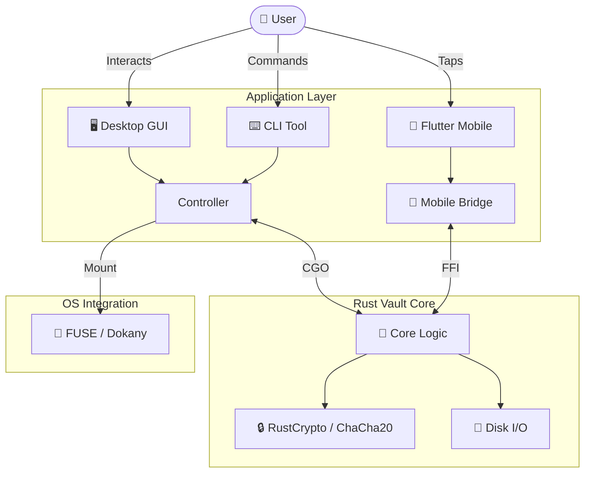

<div align="center">

# 🔒 dirLocker

> **"The only secure file is one that doesn't appear to exist."**

[](https://github.com/aka-0x4C3DD/dirLocker/actions/workflows/ci.yml)
[](https://github.com/aka-0x4C3DD/dirLocker/actions/workflows/flutter.yml)
[](https://codecov.io/gh/aka-0x4C3DD/dirLocker)
[](https://goreportcard.com/report/github.com/aka-0x4C3DD/dirLocker)
[](https://github.com/aka-0x4C3DD/dirLocker/releases)
[](https://app.codacy.com/gh/aka-0x4C3DD/dirLocker/dashboard?utm_source=gh&utm_medium=referral&utm_content=&utm_campaign=Badge_grade)
[](LICENSE)
[](go.mod)
[](vault-core/Cargo.toml)

[](README.md)
[](README.md)
[](README.md)
[](clients/mobile/README.md)

<br/>

[Getting Started](#-quick-start) • [Documentation](#-documentation) • [Architecture](#-system-architecture) • [Contributing](#-contributing)

</div>

---

<div align="justify">

**dirLocker** is a state-of-the-art cryptographic vault engineered for **plausible deniability** and **absolute content secrecy**. By fusing a high-performance **Rust** cryptographic core with a flexible **Go** application layer and a **Flutter** mobile client, dirLocker delivers military-grade security that integrates seamlessly into your native workflow.

## ✨ The Vault Protocol

| Feature                      | Description                                                                                                                                |
| :--------------------------- | :----------------------------------------------------------------------------------------------------------------------------------------- |
| **🛡️ Ironclad Security**     | Powered by **Rust**, utilizing **XChaCha20-Poly1305** & **AES-256-GCM** for high-speed, authenticated encryption.                          |
| **👻 Plausible Deniability** | Create **Hidden Volumes** inside your vault. Reveal a decoy password under coercion, keeping your true data mathematically invisible.      |
| **⚡ Zero-Lag Mounting**     | Mount vaults directly as drives using **FUSE** (Linux/macOS) and **Dokany/WinFSP** (Windows). Edit files in-place with native performance. |
| **📱 Mobile Ready**          | Full-featured Android/iOS client built with **Flutter**. Manage your encrypted vaults on the go.                                           |
| **🌑 Stealth Mode**          | Features OS-level file obfuscation and anti-forensic techniques to prevent analysis.                                                       |
| **👆 Biometric Unlock**      | Unlock your vault instantly using **Windows Hello**, **TouchID**, or Linux Secret Service.                                                 |

---

## 🏗️ System Architecture

dirLocker bridges the gap between high-level usability and low-level security through a hybrid architecture:



---

## 🚀 Quick Start

### 📦 Installation

Download the latest pre-built binary for your OS from the [Releases Page](https://github.com/aka-0x4C3DD/dirLocker/releases).

### 🛠️ Building from Source

**Prerequisites:** `Go 1.24+` • `Rust 1.70+` • `Flutter 3.13+`

<details>
<summary><strong>🖥️ Desktop (Windows/Linux/macOS)</strong></summary>

```bash
# Build the CLI and Desktop GUI
make build
```

</details>

<details>
<summary><strong>📱 Mobile (Android)</strong></summary>

```bash
# Build the Mobile APK
cd clients/mobile
flutter pub get
flutter build apk --release
```

</details>

### ⚡ First Run

**1. Initialize a Vault:**

```bash
./bin/dirlocker-cli init --path ./my-secret-vault --size 1GB
```

**2. Mount it:**

```bash
./bin/dirlocker-cli mount --path ./my-secret-vault --mountpoint ./mnt
```

**3. Done!** Any files copied to `./mnt` are now encrypted on the fly.

---

## 📚 Documentation

We believe functionality without documentation is a vulnerability. Explore our comprehensive guides:

- **[User Manual](docs/manual.md)**: Master the CLI and GUI.
- **[Mobile Guide](clients/mobile/README.md)**: Setup and usage for Android/iOS.
- **[Security Model](docs/security.md)**: Threat model, encryption standards, and key derivation.
- **[Architecture](docs/architecture.md)**: Deep dive into the Rust/Go/Flutter bridge.

---

## 🤝 Contributing

We welcome security auditors and privacy advocates.

1.  Check [docs/development.md](docs/development.md) for setup.
2.  Review our [Feature Specifications](.kiro/specs/).
3.  Submit a PR.

---

</div>
<div align="center">

**[License](LICENSE)** • **[Report Bug](https://github.com/aka-0x4C3DD/dirLocker/issues)**

<sub>

Made with ❤️ and ☕ by **kiro** & **anti-gravity**

</sub>
</div>
