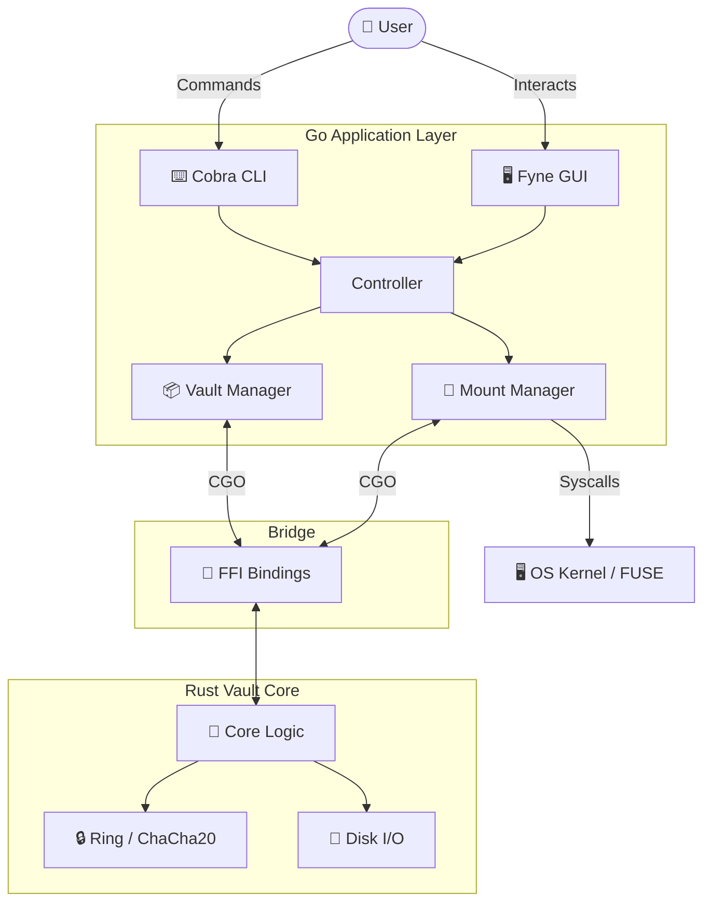

<div align="center">

# 🔒 dirLocker
### The Paranoid's Verification of Privacy


[](https://github.com/aka-0x4C3DD/dirLocker/actions)
[](LICENSE)
[](go.mod)
[](vault-core/Cargo.toml)

[](README.md)
[](README.md)
[](README.md)

[Getting Started](#-quick-start) • [Documentation](#-documentation) • [Architecture](#-architecture) • [Contributing](#-contributing)

</div>

---

## 🛑 Stop Trusting, Start Verifying

**dirLocker** is not just another file encryption tool. It is a **state-of-the-art cryptographic vault** engineered for plausible deniability and absolute content secrecy. By fusing a high-performance **Rust** cryptographic core with a flexible **Go** application layer, dirLocker delivers military-grade security that integrates seamlessly into your native OS workflow.

> "The only secure file is one that doesn't appear to exist."

## ✨ Key Features

| Feature | Description |
| :--- | :--- |
| **🛡️ Ironclad Security** | Powered by **Rust**, utilizing **AES-256-GCM** and **XChaCha20-Poly1305** for tamper-proof encryption. |
| **👆 Biometric Unlock** | Unlock your vault instantly using **Windows Hello**, **TouchID**, or Linux Secret Service without typing passwords. |
| **🎲 Secure Generator** | Built-in cryptographically strong password generator clears clipboard automatically to prevent leaks. |
| **👻 Plausible Deniability** | Create **Hidden Volumes** inside your vault. If coerced, reveal the decoy password, and the hidden data remains mathematically invisible. |
| **⚡ Native Performance** | Mount vaults directly as drives using **FUSE** (Linux/macOS) and **Dokany/WinFSP** (Windows). Zero lag, full compatibility. |
| **🌑 Stealth Mode** | Features OS-level file obfuscation and anti-forensic techniques to prevent analysis. |
| **🖥️ Cross-Platform** | A unified experience across **Windows**, **Linux**, and **macOS** with native GUI and CLI tools. |
| **📱 Mobile Ready** | Complete **Flutter** client for **Android**, **iOS**, and **Linux Phones**. securely manage vaults on the go. |
| **🔑 Recovery Assurance** | Optional cryptographic recovery keys ensure you never get locked out—unless you want to be. |

---

## 📚 Documentation

We believe functionality without documentation is a vulnerability. Explore our comprehensive guides:

### 🚀 For Users
*   **[User Manual](docs/manual.md)**: Master the CLI and GUI. Learn how to create, mount, and hide vaults.
*   **[Security Model](docs/security.md)**: Understand the threat model, encryption standards, and key derivation (Argon2id) used.

### 🛠️ For Developers & Auditors
*   **[Architecture Overview](docs/architecture.md)**: The high-level design of the Rust Core <-> Go Application bridge.
*   **[Development Guide](docs/development.md)**: How to build, test, and extend dirLocker.
*   **[Go Internals](docs/go_internals.md)**: Deep dive into the Go implementation and CGO bindings.
*   **[The Filesystem Layer](docs/filesystem.md)**: Implementation details of the FUSE and Kernel-mode mounting.
*   **[File Hiding Mechanics](docs/file_hiding.md)**: How we achieve OS-level invisibility.
*   **[Plausible Deniability](docs/deniability.md)**: The math and logic behind hidden volumes.
*   **[API Reference](docs/api.md)**: Interfaces for programmatic access.

---

## 🚀 Quick Start

### 📦 Installation
Download the latest pre-built binary for your OS from the [Releases Page](https://github.com/aka-0x4C3DD/dirLocker/releases).

### 🛠️ Building from Source

**Prerequisites:**
*   Go 1.24+
*   Rust 1.70+
*   GCC/MinGW (for CGO)

#### Windows (PowerShell)
```powershell
# Installs dependencies, builds core, and compiles binaries
.\scripts\build.ps1

# To generate an MSI installer (requires WiX Toolset)
.\scripts\package_windows.ps1
```

#### Linux / macOS
```bash
# Standard build
make build

# Create platform-specific package (.deb or .pkg)
make package-linux   # or package-macos
```

### ⚡ First Run
1.  **Initialize a Vault**:
    ```bash
    ./bin/dirlocker-cli init --path ./my-secret-vault --size 1GB
    ```
2.  **Mount it**:
    ```bash
    ./bin/dirlocker-cli mount --path ./my-secret-vault --mountpoint ./mnt
    ```
3.  **Done!** Any files copied to `./mnt` are now encrypted on the fly.

---

## 🏗️ System Architecture

The following diagram illustrates how dirLocker bridges the gap between high-level usability and low-level security:



---

## 🤝 Contributing

We welcome security auditors and privacy advocates.
1.  Check [docs/development.md](docs/development.md) for setup.
2.  Review our [Feature Specifications](.kiro/specs/).
3.  Submit a PR.

---

<div align="center">

**[License](LICENSE)** • **[Report Bug](https://github.com/aka-0x4C3DD/dirLocker/issues)**

Made with ❤️ by aka-0x4C3DD

</div>
