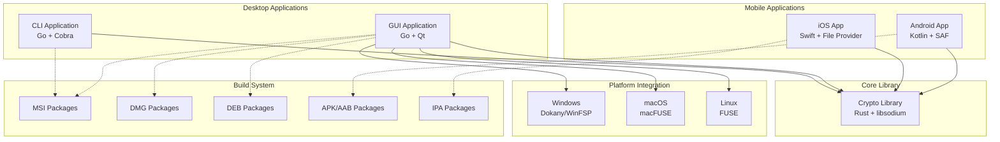

# Design Document

## Overview

The Encrypted Vault Application is a cross-platform security solution built with a layered architecture consisting of a Rust-based cryptographic core library, Go desktop applications with Qt GUI, and native mobile applications. The system implements a standardized vault container format (.vault/.vc) that provides strong encryption, metadata protection, and cross-platform interoperability while supporting advanced features like file hiding, secure sharing, and automated packaging.

## Architecture

### High-Level System Architecture



### Layered Architecture Design

1. **Core Cryptographic Layer (Rust)**

   - Vault format implementation and parsing
   - Encryption/decryption operations (AES-256-GCM, XChaCha20-Poly1305)
   - Key derivation (Argon2id) and management (HKDF)
   - File chunking and streaming operations
   - Cross-platform C-compatible FFI interface

2. **Application Logic Layer (Go)**

   - Business logic and workflow management
   - Vault operations wrapper and abstraction
   - File hiding functionality implementation
   - Icon management and detection system
   - Configuration and settings management

3. **User Interface Layer**

   - Desktop: Qt-based GUI and CLI interface
   - Mobile: Native platform applications with file provider integration

4. **Platform Integration Layer**

   - Filesystem mounting (FUSE, Dokany, macFUSE)
   - OS-specific file hiding mechanisms
   - Platform keystore integration
   - Hardware acceleration detection

5. **Build and Distribution Layer**
   - Cross-compilation and packaging automation
   - Platform-specific installer generation
   - Code signing and notarization
   - Icon integration and resource embedding

## Components and Interfaces

### Core Cryptographic Library (Rust)

**Primary Responsibilities:**

- Implement vault container format specification
- Provide secure cryptographic operations
- Handle file chunking and streaming
- Manage key derivation and subkey generation
- Export C-compatible FFI interface

**Key Dependencies:**

- `chacha20poly1305` for XChaCha20-Poly1305 operations
- `aes-gcm` for AES-256-GCM operations
- `argon2` for key derivation functions
- `hkdf` for key expansion and subkey derivation
- `x25519-dalek` for asymmetric key operations

**Public API Interface:**

```rust
// Core vault operations
pub extern "C" fn vault_create(path: *const c_char, password: *const c_char, cipher: u32) -> VaultHandle;
pub extern "C" fn vault_open(path: *const c_char, unlock_material: *const UnlockMaterial) -> VaultHandle;
pub extern "C" fn vault_get_id(path: *const c_char, uuid_out: *mut *mut c_char) -> c_int; // New for UUID binding
pub extern "C" fn vault_close(handle: VaultHandle) -> i32;

// File operations
pub extern "C" fn vault_list_files(handle: VaultHandle, entries: *mut *mut FileEntry, count: *mut usize) -> i32;
pub extern "C" fn vault_read_file(handle: VaultHandle, path: *const c_char, data: *mut *mut u8, size: *mut usize) -> i32;
pub extern "C" fn vault_write_file(handle: VaultHandle, path: *const c_char, data: *const u8, size: usize) -> i32;

// Streaming operations
pub extern "C" fn vault_open_stream(handle: VaultHandle, path: *const c_char) -> StreamHandle;
pub extern "C" fn vault_read_chunk(stream: StreamHandle, offset: u64, size: usize, data: *mut u8) -> i32;

// Sharing and key management
pub extern "C" fn vault_export_envelope(handle: VaultHandle, pubkeys: *const *const u8, count: usize) -> *mut Envelope;
pub extern "C" fn vault_change_password(handle: VaultHandle, old_pass: *const c_char, new_pass: *const c_char) -> i32;
```

### Go Application Layer

**Desktop CLI Application:**

- Command-line interface using Cobra framework
- Comprehensive vault management operations
- Scriptable interface for automation
- Cross-platform binary distribution

**Desktop GUI Application:**

- Qt-based graphical interface using therecipe/qt
- Vault browser with tree view and file operations
- Mount/unmount functionality with platform integration
- File hiding interface with visual indicators
- Settings and configuration management

**Vault Manager Component:**

```go
type VaultManager struct {
    coreLib    *CoreLibrary
    config     *Config
    fileHider  FileHider
    iconMgr    *IconManager
}

func (vm *VaultManager) CreateVault(path, password string, cipher CipherType) error
func (vm *VaultManager) OpenVault(path, password string) (*Vault, error)
func (vm *VaultManager) MountVault(vault *Vault, mountPoint string) error
func (vm *VaultManager) UnmountVault(vault *Vault) error
```

**File Hiding System:**

```go
type FileHider interface {
    HideFile(path string) error
    UnhideFile(name string) error
    ListHidden() ([]HiddenFileInfo, error)
    IsHidden(path string) bool
}

type WindowsFileHider struct {
    hiddenDir string
    registry  *EncryptedRegistry
}

type UnixFileHider struct {
    hiddenDir string
    registry  *EncryptedRegistry
}
```

**Icon Management System:**

```go
type IconManager struct {
    appDir      string
    currentIcon string
    defaultIcon []byte
}

func (im *IconManager) DetectCustomIcon() (string, error)
func (im *IconManager) ApplyIcon(iconPath string) error
func (im *IconManager) HandleMultipleIcons(icons []string) (string, error)
```

### Mobile Applications

**iOS Application (Swift):**

- File Provider extension for Files app integration
- Core library integration via C FFI
- Touch ID/Face ID authentication
- Document picker and sharing integration

**Android Application (Kotlin):**

- DocumentProvider implementation using SAF
- Material Design UI components
- Biometric authentication support
- Core library integration via JNI

### Biometric Authentication Layer

- **Design**: 3-Tier Architecture.
  1.  **React**: Manages UI consent and calls `GetVaultID` to retrieve immutable UUID.
  2.  **Go Middleware**: Exposes `GetVaultID` and bridges credential requests.
  3.  **Rust Core**: Uses `keyring` crate to interface with Windows Credential Manager / Keychain.
- **Security**: Credentials are never stored in the vault file itself. They are stored in the OS enclave, keyed by `dirLocker::{vault_uuid}`.

### Platform Integration Components

**Filesystem Mounting:**

- Windows: Dokany or WinFSP integration with UAC elevation handling
- macOS: macFUSE integration with Gatekeeper compatibility
- Linux: FUSE integration with distribution-specific packaging
  > For detailed implementation details of the filesystem layer, see [Filesystem Architecture](filesystem.md).

**File Hiding Implementation:**

_Windows Strategy:_

- Move files to `%APPDATA%\VaultApp\hidden\{uuid}\`
- Apply Windows hidden and system file attributes
- Store encrypted registry in `%APPDATA%\VaultApp\registry.enc`
- Use Windows API for attribute manipulation

_Unix Strategy (macOS/Linux):_

- Move files to `~/.vaultapp/hidden/{uuid}/`
- Use extended attributes for additional metadata
- Store encrypted registry in `~/.vaultapp/registry.enc`
- Leverage platform-specific hidden directory conventions

_Mobile Strategy:_

- iOS: Use app Documents directory with file coordination
- Android: Use app private storage with SAF integration
- Both platforms naturally sandbox files from other applications

## Data Models

### Vault Container Format

Enhanced format with dedicated metadata sections to prevent corruption:

```
[Magic][Version][HeaderLen][HeaderJSON][MetadataSections][FileTable][Chunks...]

Magic: "VLT1" (4 bytes ASCII)
Version: 0x02 (1 byte) - Updated for metadata sections support
HeaderLen: Big-endian 32-bit length of HeaderJSON
HeaderJSON: UTF-8 encoded core metadata (fixed structure)
MetadataSections: Variable-length encrypted metadata sections
FileTable: Encrypted JSON file listing
Chunks: AEAD-encrypted file content segments
```

**Header JSON Structure (Fixed Core):**

```json
{
  "cipher": "xchacha20poly1305" | "aes-256-gcm",
  "kdf": "argon2id",
  "kdf_params": {
    "salt": "base64-encoded-salt",
    "memory": 65536,
    "operations": 3,
    "parallelism": 1
  },
  "vault_uuid": "uuid-v4",
  "file_table_offset": 1234,
  "file_table_size": 5678,
  "chunk_size": 4194304,
  "created_at": "2024-01-01T00:00:00Z",
  "platform_hint": "windows",
  "metadata_sections_offset": 890,
  "metadata_sections_size": 344
}
```

**Metadata Sections Structure:**

```
[SectionCount][Section1][Section2]...[SectionN]

SectionCount: Big-endian 32-bit number of sections
Each Section: [TypeLen][Type][DataLen][EncryptedData]
  TypeLen: Big-endian 32-bit length of type string
  Type: UTF-8 section type identifier
  DataLen: Big-endian 32-bit length of encrypted data
  EncryptedData: AEAD-encrypted section content
```

**Supported Metadata Section Types:**

- `"hidden_tables"`: Plausible deniability hidden file table metadata
- `"sharing_keys"`: X25519 recipient keys and envelope data
- `"recovery_info"`: Recovery key metadata and hints
- `"user_settings"`: User preferences and configuration
- `"audit_log"`: Encrypted operation audit trail

**File Table Structure:**

```json
{
  "files": [
    {
      "name_encrypted": "base64-encrypted-filename",
      "iv": "base64-nonce",
      "size": 1024,
      "chunks": [{ "offset": 2048, "size": 1024, "iv": "base64-chunk-nonce" }],
      "mtime": "2024-01-01T00:00:00Z",
      "mode": 644,
      "is_dir": false
    }
  ]
}
```

### Application Data Models

**Hidden File Registry:**

```go
type HiddenFileRegistry struct {
    Version int                        `json:"version"`
    Files   map[string]HiddenFileInfo `json:"files"`
    Salt    []byte                    `json:"salt"`
}

type HiddenFileInfo struct {
    OriginalPath string    `json:"original_path"`
    HiddenPath   string    `json:"hidden_path"`
    HiddenAt     time.Time `json:"hidden_at"`
    FileSize     int64     `json:"file_size"`
    Permissions  os.FileMode `json:"permissions"`
    Checksum     string    `json:"checksum"`
}
```

**Configuration Model:**

```go
type Config struct {
    DefaultCipher    CipherType        `json:"default_cipher"`
    KDFParams       ArgonParams       `json:"kdf_params"`
    MountPoints     map[string]string `json:"mount_points"`
    AutoLockTimeout time.Duration     `json:"auto_lock_timeout"`
    HiddenDir       string           `json:"hidden_dir"`
    IconPath        string           `json:"icon_path"`
    LogLevel        string           `json:"log_level"`
}
```

## Error Handling

### Error Classification and Handling Strategy

**Cryptographic Errors:**

- `InvalidPassword`: Wrong password or corrupted key derivation
- `UnsupportedCipher`: Vault uses unsupported encryption algorithm
- `CorruptedVault`: Vault file integrity check failed
- `KeyDerivationFailed`: Argon2id operation failed

**File System Errors:**

- `MountFailed`: Unable to mount vault (missing drivers, permissions)
- `FileNotFound`: Requested file doesn't exist in vault
- `InsufficientSpace`: Not enough disk space for operation
- `PermissionDenied`: Insufficient permissions for file operation

**Platform-Specific Errors:**

- `DriverNotInstalled`: Required FUSE/Dokany driver not available
- `ElevationRequired`: Operation requires administrator privileges
- `UnsupportedPlatform`: Feature not available on current platform

**Error Propagation Strategy:**

```go
type VaultError struct {
    Code    ErrorCode `json:"code"`
    Message string    `json:"message"`
    Details string    `json:"details,omitempty"`
    Cause   error     `json:"-"`
}

func (e *VaultError) Error() string {
    return fmt.Sprintf("vault error %d: %s", e.Code, e.Message)
}

// Error handling in operations
func (vm *VaultManager) OpenVault(path, password string) (*Vault, error) {
    handle, err := vm.coreLib.OpenVault(path, password)
    if err != nil {
        switch err.Code {
        case InvalidPasswordError:
            return nil, &VaultError{
                Code:    InvalidPassword,
                Message: "Invalid password or corrupted vault",
                Details: "Please check your password and try again",
                Cause:   err,
            }
        case CorruptedVaultError:
            return nil, &VaultError{
                Code:    CorruptedVault,
                Message: "Vault file appears to be corrupted",
                Details: "Try using the repair command to recover data",
                Cause:   err,
            }
        }
    }
    return &Vault{handle: handle}, nil
}
```

### Recovery and Repair Mechanisms

**Vault Repair System:**

- Chunk-level integrity verification using AEAD tags
- File table reconstruction from valid chunks
- Partial recovery of uncorrupted files
- Backup creation before repair attempts

**Atomic Operations:**

- Write-to-temporary-file-then-rename pattern
- Transaction logging for multi-step operations
- Rollback capability for failed operations
- Periodic integrity checks and auto-repair

## Testing Strategy

### Unit Testing

**Core Library Testing (Rust):**

```rust
#[cfg(test)]
mod tests {
    use super::*;

    #[test]
    fn test_vault_creation_with_test_vectors() {
        // Test with known cryptographic test vectors
        let vault = create_vault("test.vault", "password", CipherType::XChaCha20Poly1305);
        assert!(vault.is_ok());
    }

    #[test]
    fn test_cross_platform_compatibility() {
        // Create vault with specific parameters
        // Verify it can be opened with same parameters
    }

    #[test]
    fn test_chunk_streaming() {
        // Test large file chunking and random access
    }
}
```

**Go Application Testing:**

```go
func TestVaultManager_CreateAndOpen(t *testing.T) {
    vm := NewVaultManager()

    // Test vault creation
    err := vm.CreateVault("test.vault", "password", XChaCha20Poly1305)
    require.NoError(t, err)

    // Test vault opening
    vault, err := vm.OpenVault("test.vault", "password")
    require.NoError(t, err)
    require.NotNil(t, vault)
}

func TestFileHiding_WindowsImplementation(t *testing.T) {
    if runtime.GOOS != "windows" {
        t.Skip("Windows-specific test")
    }

    hider := NewWindowsFileHider()

    // Create test file
    testFile := "test_file.txt"
    err := ioutil.WriteFile(testFile, []byte("test content"), 0644)
    require.NoError(t, err)

    // Test hiding
    err = hider.HideFile(testFile)
    require.NoError(t, err)

    // Verify file is hidden from OS
    _, err = os.Stat(testFile)
    require.True(t, os.IsNotExist(err))

    // Test unhiding
    err = hider.UnhideFile("test_file.txt")
    require.NoError(t, err)

    // Verify file is visible again
    _, err = os.Stat(testFile)
    require.NoError(t, err)
}
```

### Integration Testing

**Cross-Platform Compatibility:**

- Automated testing on Windows, macOS, Linux, iOS, Android
- Vault creation on one platform, opening on another
- File format compatibility verification
- Performance benchmarking across platforms

**Mount Simulation (Windows specific):**

- **Challenge**: WinFSP or Dokany drivers might not be present in all CI/Test environments, and installing them requires admin privileges/restarts.
- **Solution**: We use a `subst`-based simulation for integration tests when actual drivers are missing or for testing the integration logic itself.
  - The `simulateMount` function maps a drive letter to a temporary directory using `subst <drive>: <path>`.
  - The `simulateUnmount` function removes the mapping using `subst <drive>: /d`.
- **Benefit**: Allows `TestMountIntegration` and `mount-helper` command flow to be verified (process creation, argument passing, signal handling) without depending on the heavy kernel-level drivers.

**End-to-End Workflows:**

- Complete vault lifecycle testing (create, populate, mount, modify, unmount)
- File hiding and unhiding workflows
- Sharing and multi-recipient scenarios
- Password change and recovery key operations

### Security Testing

**Cryptographic Validation:**

- Test vector verification for all supported ciphers
- Key derivation parameter validation
- Nonce uniqueness verification
- AEAD tag validation

**Attack Resistance Testing:**

- Memory dump analysis for key material leakage
- Timing attack resistance verification
- Side-channel attack mitigation testing
- Fuzzing of vault file format parsing

### Performance Testing

**Scalability Testing:**

- Large vault performance (1000+ files, multi-GB sizes)
- Concurrent access patterns
- Memory usage profiling
- Mount/unmount performance

**Mobile Performance:**

- Battery usage optimization verification
- Memory constraint testing
- Background processing limitations
- Network usage for future sync features

### Build and Deployment Testing

**Package Verification:**

- Automated package creation and installation testing
- Code signing verification
- Icon integration validation
- Cross-compilation verification

**Distribution Testing:**

- App store submission validation (iOS, Android)
- Notarization verification (macOS)
- Antivirus compatibility testing (Windows)
- Package manager integration (Linux)

This comprehensive design provides a solid foundation for implementing the encrypted vault application with all requested features while maintaining security, performance, and cross-platform compatibility.

### Biometric Testing

- **Lifecycle**: Verify Save/Read/Delete operations via `test_biometrics_lifecycle`.
- **Stability**: Verify usage of `vault_get_id` on locked files.
- **Manual Scenarios**:
  - **Renaming**: Ensure renaming a `.vault` file does not break biometric unlock (verifies UUID binding).
  - **Revocation**: Ensure removing credentials from OS manager properly fails in UI.

## Known Limitations

### Plausible Deniability Persistence

Currently, hidden tables metadata (used for plausible deniability) is **not persisted** across vault sessions.

- **Behavior**: Hidden tables and their contents exist/work perfectly during the session they are created in.
- **Limitation**: Closing the vault loses the reference to these hidden tables. Ropening the vault will not show them.
- **Reason**: Updating the vault header to store hidden table metadata changes the header size, which would shift file offsets and corrupt valid data in the current vault format.
- **Workaround**: Users must recreate hidden tables/containers for each session if they wish to use them, or wait for a future format update (v3) that supports dynamic header sizing or detached metadata.
